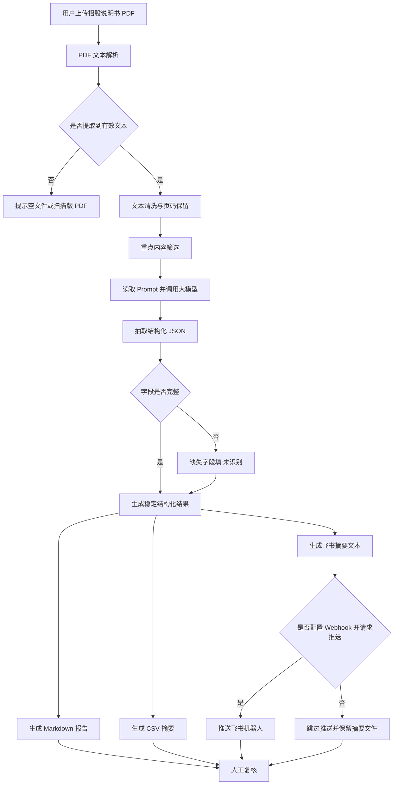

# ProspectusInsight Agent 项目文档、展示材料与反思总结

> 项目名称：ProspectusInsight Agent：招股说明书智能解读与公司画像生成助手  
> 项目类型：AI 智能体设计开发及应用课程大作业  
> 适用范围：公开招股说明书资料整理、学习辅助和初步分析  
> 重要边界：本项目不构成投资建议，不输出买卖建议、目标价、投资评级或收益预测；所有关键事实、财务数据和风险判断均需人工复核。

## 一、项目概述

ProspectusInsight Agent 是一个面向招股说明书阅读场景的智能体应用。用户上传招股说明书 PDF 后，系统自动完成 PDF 文本解析、重点内容筛选、结构化信息抽取、Markdown/CSV/JSON 报告生成，并可选将摘要推送到飞书机器人。

本项目聚焦“公开披露文件的结构化整理”这一明确任务。招股说明书通常篇幅长、章节多、信息密度高，人工阅读时需要在公司概况、业务、行业、财务、风险因素、募集资金用途等章节之间反复查找。该智能体通过工作流和大模型协同，把长文档转换为便于学习、讨论和复核的结构化公司画像。

## 二、服务对象

本智能体主要服务以下对象：

| 服务对象 | 使用场景 |
| --- | --- |
| 金融专业学生 | 阅读上市招股说明书，训练公司分析、行业分析和风险识别能力 |
| 行业研究实习生 | 快速梳理公司业务、财务和风险信息，形成初步资料包 |
| 投行、咨询、数据分析初学者 | 学习公开披露文件的信息抽取方法和报告组织方式 |
| 课程项目组成员 | 共同完成资料整理、报告撰写、展示汇报和飞书协同通知 |

本项目不面向投资决策用户，不提供任何交易建议，只作为公开资料整理和课程学习辅助工具。

## 三、具体问题与痛点

当前场景中的主要低效环节包括：

1. 招股说明书页数多、信息密度高，初学者第一次阅读时很难快速抓住重点。
2. 公司简介、发展历程、核心高管、股权架构、行业格局、主营业务、财务指标和风险提示分散在不同章节。
3. 人工整理 Markdown 报告、CSV 摘要和飞书通知文本耗时较长，且容易遗漏字段。
4. 不同小组成员对同一份材料的整理口径可能不一致，后续讨论缺少统一结构。
5. 直接让大模型自由回答容易出现补充外部信息、编造细节或给出不恰当投资判断的风险。

因此，本项目的设计重点不是“替代专业判断”，而是把重复性的阅读、提取、整理、格式化和协同通知流程自动化，同时保留“未识别”和“人工复核”机制。

## 四、输入内容

用户需要输入：

| 输入项 | 是否必填 | 说明 |
| --- | --- | --- |
| 招股说明书 PDF | 必填 | 用户上传的公开招股说明书文件，当前版本主要支持可提取文本的 PDF |
| 公司名称 | 可选 | 用户可手动填写；留空时由模型从 PDF 文本中识别 |
| 是否推送飞书 | 可选 | 勾选后调用飞书机器人 Webhook 推送摘要 |
| `.env` 配置 | 运行时需要 | 包括 `LLM_API_KEY`、`LLM_BASE_URL`、`LLM_MODEL`、`FEISHU_WEBHOOK_URL` 等 |

系统不会联网搜索公司资料，也不会用外部资料补齐 PDF 中没有披露的信息。输入为英文、繁体中文或中英混合时，面向用户的主要输出仍使用简体中文。

## 五、输出结果

智能体最终生成以下结果：

| 输出结果 | 文件或位置 | 说明 |
| --- | --- | --- |
| 页面解读结果 | Streamlit 页面 | 按标签页展示公司简介、行业分析、业务分析、财务分析、风险与募资、证据与复核 |
| Markdown 报告 | `code/outputs/prospectus_report.md` | 面向阅读和提交的完整解读报告 |
| JSON 结构化结果 | `code/outputs/prospectus_analysis.json` | 稳定字段的结构化抽取结果，便于二次处理 |
| CSV 摘要表 | `code/outputs/prospectus_summary.csv` | 公司名称、行业、业务模式、收入来源、财务、风险、募资用途等摘要字段 |
| 飞书摘要文本 | `code/outputs/feishu_message.txt` | 适合群通知的短摘要 |
| 飞书机器人推送 | 飞书群 | 在配置 Webhook 后可推送摘要和报告路径 |

报告至少覆盖以下模块：

1. 公司简介：基本信息、发展历程、核心高管、股权架构、上市信息。
2. 行业分析：行业发展现状、市场驱动因素、竞争格局、公司行业地位。
3. 业务分析：业务模式、核心产品或服务、收入拆分、客户与供应商、商业化进展。
4. 财务分析：主要财务指标、收入利润现金流变化、资产负债、关键变化、财务不确定性。
5. 风险提示：主要风险、风险影响、原文依据。
6. 募资用途：募资项目、金额或比例、资金用途、未识别项目。
7. 尽调问题：公司治理、业务产品、财务经营、风险核验、募资用途核验。
8. 证据片段和不确定性说明：标注模型依据和需要人工复核的内容。

## 六、处理步骤

智能体工作流如下：



具体流程：

1. 用户在 Streamlit 页面上传招股说明书 PDF。
2. `pdf_parser.py` 使用 PyMuPDF 提取 PDF 文本，并保留页码信息。
3. `pipeline.py` 对长文本做重点内容筛选，优先保留公司概况、业务、财务、风险、募集资金用途等相关段落。
4. `llm_client.py` 读取 Prompt 和 `.env` 配置，调用 OpenAI-compatible API。
5. 大模型按固定 JSON schema 抽取公司、行业、业务、财务、风险、募资用途和尽调问题。
6. `ensure_schema` 对缺失字段进行补齐，统一填入“未识别”，避免输出结构不稳定。
7. `report_generator.py` 生成 Markdown 报告。
8. `pipeline.py` 保存 JSON、CSV、Markdown 和飞书摘要。
9. `feishu_bot.py` 在用户请求且 Webhook 配置完整时推送飞书消息。
10. 用户根据报告中的证据片段和不确定性说明回到原始招股说明书复核。

## 七、模型任务

大模型主要承担理解、抽取、归纳和生成类任务：

| 模型任务 | 说明 |
| --- | --- |
| 文档理解 | 理解招股说明书中的公司、行业、业务、财务、风险和募资相关内容 |
| 信息分类 | 将原文信息归入公司简介、行业分析、业务分析、财务分析、风险提示等模块 |
| 结构化抽取 | 按固定 JSON 字段输出公司名称、上市市场、核心产品、收入拆分、主要财务指标等 |
| 摘要生成 | 将长段落压缩为适合报告展示的简体中文摘要 |
| 尽调问题生成 | 基于披露内容生成后续核验问题，帮助用户发现需要进一步确认的事项 |
| 不确定性说明 | 对缺失、模糊或证据不足的信息进行说明 |

模型必须遵守以下约束：

1. 只基于用户上传 PDF 的可提取文本回答。
2. 不联网搜索，不补充外部事实。
3. 未披露、未识别或证据不足的信息写“未识别”。
4. 输出使用简体中文。
5. 不生成投资建议、目标价、评级、收益预测或交易结论。
6. 关键数据和风险结论保留人工复核提示。

## 八、工具任务

工作流、代码、CLI 和飞书承担确定性任务：

| 工具任务 | 对应模块 |
| --- | --- |
| PDF 解析 | `agent/pdf_parser.py` 使用 PyMuPDF 提取文本 |
| 文本筛选 | `agent/pipeline.py` 根据关键词和长度限制保留重点段落 |
| API 调用 | `agent/llm_client.py` 读取 `.env` 并调用 OpenAI-compatible API |
| Schema 补齐 | `agent/pipeline.py` 对缺失字段填“未识别” |
| Markdown 生成 | `agent/report_generator.py` 生成完整报告 |
| CSV/JSON 保存 | `agent/pipeline.py` 保存结构化输出 |
| 飞书消息构造与推送 | `agent/feishu_bot.py` 生成短摘要并推送 Webhook |
| Streamlit 交互界面 | `agent/app.py` 提供上传、运行、展示和下载入口 |
| CLI 运行和测试 | `scripts/run_pipeline.py`、`scripts/test_api.py`、`scripts/test_feishu.py` |
| 静态展示网站 | `code/index.html`、`code/pages/`、`code/css/`、`code/js/` |

工具部分负责“可重复、可验证、格式稳定”的流程，大模型负责“理解、总结、归类、生成”的语言任务，两者结合形成完整智能体。

## 九、异常情况处理

| 异常情况 | 处理方式 |
| --- | --- |
| 用户未上传 PDF | Streamlit 页面提示“请先上传招股说明书 PDF” |
| PDF 为空 | 提示上传有效 PDF |
| PDF 为扫描版或无法提取足够文本 | 提示可能需要先 OCR 后再上传 |
| 缺少 `LLM_API_KEY` | 提示配置 `.env`，不继续调用模型 |
| LLM 调用失败 | 返回可读错误信息，避免页面崩溃 |
| 模型输出缺字段 | 自动按 schema 补齐，缺失内容写“未识别” |
| 模型输出非 JSON | 返回模型格式异常提示，后续可通过 Prompt 继续收紧 |
| 飞书 Webhook 未配置 | 跳过推送，保留本地摘要文件，不影响报告生成 |
| PDF 中没有披露某项信息 | 不编造，报告中标注“未识别”或写入不确定性说明 |
| 结果可能不准确 | 报告首部和页面提示用户进行人工复核 |

## 十、项目实现结构

```text
code/
├── agent/
│   ├── app.py                 # Streamlit 应用入口
│   ├── pipeline.py            # 主流程：解析、筛选、抽取、输出、飞书
│   ├── pdf_parser.py          # PDF 文本提取
│   ├── llm_client.py          # OpenAI-compatible API 调用
│   ├── report_generator.py    # Markdown 报告生成
│   └── feishu_bot.py          # 飞书消息构造与推送
├── prompts/
│   └── extraction_prompt.md   # 结构化抽取 Prompt
├── scripts/
│   ├── run_pipeline.py        # CLI 运行 pipeline
│   ├── test_api.py            # API 连通性测试
│   └── test_feishu.py         # 飞书机器人测试
├── tests/
│   ├── test_detailed_schema.py
│   ├── test_detailed_report_generator.py
│   └── test_feishu_message.py
├── docs/
│   └── final_project_documentation.md
└── outputs/
    ├── prospectus_analysis.json
    ├── prospectus_report.md
    ├── prospectus_summary.csv
    └── feishu_message.txt
```

## 十一、运行与验证方式

进入 `code` 目录后，推荐使用 `uv` 安装依赖并运行：

```bash
uv venv
uv pip install -r requirements.txt
```

配置 `.env`：

```text
LLM_API_KEY=你的 API Key
LLM_BASE_URL=OpenAI-compatible Base URL，可留空使用默认 OpenAI 地址
LLM_MODEL=模型名称
FEISHU_WEBHOOK_URL=飞书自定义机器人 Webhook，可选
```

运行 Streamlit：

```bash
uv run python -m streamlit run agent/app.py
```

运行 CLI pipeline：

```bash
uv run python scripts/run_pipeline.py --pdf data/example_prospectus.pdf --company "示例公司"
```

使用根目录样例 PDF 调试：

```bash
uv run python scripts/run_pipeline.py --pdf ../英矽智能招股说明书.pdf --company "英矽智能"
```

可选测试命令：

```bash
uv run python scripts/test_api.py
uv run python scripts/test_feishu.py
uv run python -m unittest tests.test_detailed_schema tests.test_detailed_report_generator tests.test_feishu_message -v
```

说明：

- `test_api.py` 需要有效 `LLM_API_KEY`。
- `test_feishu.py` 需要有效 `FEISHU_WEBHOOK_URL`，未配置时应友好提示。
- 静态网页可直接打开 `code/index.html` 检查，也可用本地静态服务器预览。

## 十二、展示材料

以下内容用于课堂展示或答辩。具体截图由展示者自行补充到对应位置。

### 1. 项目首页截图

建议截图内容：

- 展示网站首页。
- 项目名称 ProspectusInsight Agent。
- 功能定位：招股说明书智能解读与公司画像生成助手。
- 明亮、简洁、专业的页面风格。

图片占位：

```markdown

```

展示说明：

> 首页用于向评审说明项目主题、服务对象和核心能力。项目不是泛泛的聊天机器人，而是聚焦招股说明书 PDF 的专业资料整理智能体。

### 2. Streamlit 上传界面截图

建议截图内容：

- PDF 上传入口。
- 公司名称可选输入框。
- 飞书推送勾选框。
- “本工具不构成投资建议，AI 输出需人工复核”的边界提示。

图片占位：

```markdown

```

展示说明：

> 用户只需要上传招股说明书 PDF，可选填写公司名称。系统在界面中明确提示项目边界，避免把 AI 整理结果误解为投资建议。

### 3. 智能解读结果截图

建议截图内容：

- 公司简介、行业分析、业务分析、财务分析、风险与募资、证据与复核等标签页。
- 展示一两个字段的结构化结果。
- 展示“未识别”或不确定性说明。

图片占位：

```markdown

```

展示说明：

> 解读结果按课程要求拆分为多个模块，便于用户快速定位公司画像、业务模式、财务信息、风险提示和募资用途。缺失或证据不足的信息不会编造，而是标注为“未识别”。

### 4. Markdown 报告截图

建议截图内容：

- `prospectus_report.md` 的标题和前几节。
- 公司简介、业务分析、风险提示或证据片段模块。

图片占位：

```markdown

```

展示说明：

> Markdown 报告适合课程提交和团队阅读，保留资料来源、生成说明、九大结构化章节和人工复核提示。

### 5. JSON/CSV 输出截图

建议截图内容：

- `prospectus_analysis.json` 的稳定字段结构。
- `prospectus_summary.csv` 的摘要列。

图片占位：

```markdown

```

展示说明：

> JSON 便于后续程序读取，CSV 便于表格查看和团队汇总。字段缺失时统一填“未识别”，保证数据结构稳定。

### 6. 飞书机器人摘要截图

建议截图内容：

- 飞书群中的机器人推送消息。
- 摘要中包含公司名称、业务、风险、报告路径或复核提示。

图片占位：

```markdown

```

展示说明：

> 飞书机器人用于课程项目组协同。生成报告后，系统可将短摘要推送到飞书群，方便成员快速了解结果并继续人工复核。

### 7. 工作流页面截图

建议截图内容：

- 静态网页中的工作流说明页面。
- 展示 PDF 上传、解析、抽取、报告生成、飞书推送、人工复核的流程。

图片占位：

```markdown

```

展示说明：

> 工作流页面用于说明智能体不是单次问答，而是由 PDF 解析、模型抽取、结构化输出、协同推送和异常处理组成的完整流程。

## 十三、课程要求对应关系

| 课程要求 | 项目对应实现 |
| --- | --- |
| 面向真实场景发现问题，明确目标和边界 | 聚焦招股说明书阅读和结构化整理，明确不做投资建议 |
| 使用智能体工具设计逻辑结构工作流 | 上传、解析、筛选、LLM 抽取、报告生成、飞书推送、人工复核 |
| 开发应用界面、辅助工具或数据处理脚本 | Streamlit 应用、CLI 脚本、静态展示网站 |
| 使用智能体辅助代码生成、解释、修复、优化或测试 | 通过 AI 辅助完成项目结构、Prompt、异常处理、测试用例和文档 |
| 结合飞书协同流程 | 支持飞书机器人摘要推送 |
| 使用 CLI 完成运行、接口测试、脚本执行 | 提供 `run_pipeline.py`、`test_api.py`、`test_feishu.py` |
| 通过测试与迭代提高稳定性 | 覆盖正常 PDF、空文件、扫描版、缺 API Key、缺 Webhook、JSON 缺字段等场景 |
| 形成完整项目文档、展示材料和反思总结 | 本文件整合项目说明、展示截图占位、课程对应表和反思总结 |

## 十四、测试与迭代总结

本项目的测试重点围绕“能运行、输出稳定、不编造、异常可读”展开。

已设计或执行的测试包括：

1. 正常招股说明书 PDF：验证能生成文本、JSON、CSV、Markdown 和飞书摘要。
2. 空文件：验证是否提示上传有效 PDF。
3. 扫描版 PDF：验证是否提示需要 OCR。
4. 缺少 API Key：验证是否提示配置 `.env`。
5. 飞书 Webhook 未配置：验证是否跳过推送且不影响报告生成。
6. LLM 输出字段缺失：验证 schema 是否自动补齐“未识别”。
7. Markdown 报告结构：验证公司简介、行业分析、业务分析、财务分析、风险提示、募资用途、尽调问题、证据片段等章节是否完整。
8. 飞书摘要：验证消息长度和内容是否适合群通知。

迭代优化措施：

- 增加嵌套 JSON schema，使输出字段更稳定。
- 在 Prompt 和报告中反复强调“只基于原文，不得编造”。
- 对缺字段统一填“未识别”，减少前端和报告生成错误。
- 增加人工复核提示，避免用户把 AI 摘要当成最终结论。
- 静态网页改为更明亮、简洁、专业的展示风格，并补充页面导航。
- Demo 页面优先连接真实后端能力，API 未响应时才使用离线演示。

## 十五、项目反思

### 1. AI 自动化的价值

AI Agent 适合处理“长文档阅读后形成结构化材料”的重复性工作。招股说明书本身信息公开，但篇幅长、章节多、专业性强。通过 PDF 解析、LLM 抽取、报告生成和飞书通知，系统可以帮助学生更快建立公司画像，降低第一次阅读公开披露文件的门槛。

### 2. 大模型适合做什么

大模型适合完成理解、归纳、分类、摘要和问题生成。例如，它可以把业务模式、风险因素、募资用途等分散内容整理成统一结构，也可以基于披露信息生成后续尽调问题。这些任务依赖语言理解和上下文归纳，适合由模型完成。

### 3. 工具和代码为什么仍然重要

如果只使用聊天式大模型，输出格式容易不稳定，也难以保存、复用和协同。项目中使用 Python pipeline、固定 schema、Markdown/CSV/JSON 输出和飞书推送，把模型能力嵌入可重复的工作流中。工具负责流程控制和格式稳定，模型负责语义理解，两者结合才更像一个完整智能体。

### 4. 幻觉与误读风险

招股说明书分析涉及财务、法律、行业和监管表达。模型可能因为 PDF 解析错误、表格抽取不完整、上下文截断或 Prompt 理解偏差而遗漏信息或误读含义。因此项目必须限制模型只基于上传文本回答，并在缺失信息时写“未识别”。这比“让结果看起来完整”更重要。

### 5. 为什么保留人工复核

公司财务指标、股权结构、募集资金用途和风险因素都可能影响读者对企业的理解。AI 输出只能作为初步资料整理，不能替代原文核验和专业判断。因此报告首部、页面提示和结果字段中都保留人工复核说明，要求用户回到原始招股说明书确认关键内容。

### 6. 为什么不做投资建议

本项目是课程学习和公开资料整理工具，不具备完整尽职调查、估值建模、审计、法律核验和投资决策能力。为了避免误导用户，系统不输出买入、卖出、持有、目标价、收益预测或投资评级，只输出结构化信息、风险提示和尽调问题。

### 7. 开发过程中的收获

本项目体现了 AI 智能体开发中的几个关键点：

- 真实场景要先明确边界，否则很容易从“资料整理”扩展成不可靠的“投资判断”。
- Prompt 需要和代码 schema 配合，才能得到稳定输出。
- 异常处理比理想路径更重要，尤其是空 PDF、扫描件、缺 API Key、缺 Webhook 等演示时常见问题。
- 展示网站不仅要好看，还要讲清楚项目解决什么问题、如何工作、如何控制风险。
- 飞书推送让智能体结果进入协同流程，比单纯生成本地文件更符合课程要求。

### 8. 当前局限与未来改进

当前版本仍有局限：

1. 对扫描版 PDF 不能直接 OCR，需要用户先转换为可提取文本的 PDF。
2. 表格型财务数据的抽取受 PDF 质量和模型上下文限制，可能不完整。
3. 长招股说明书需要进行文本筛选，可能遗漏部分低频但重要信息。
4. 当前只支持单份招股说明书，不支持多公司对比、年报对比或多轮问答核验。
5. 飞书推送只发送摘要，不自动创建飞书文档或表格。

后续可以扩展：

- 接入 OCR，提高扫描版 PDF 支持能力。
- 增强表格识别和页码级证据引用。
- 增加多公司对比和多版本报告对比。
- 将输出同步到飞书文档或飞书表格。
- 增加人工标注反馈，用于改进 Prompt 和字段抽取质量。

## 十六、结论

ProspectusInsight Agent 将招股说明书阅读流程拆分为可执行的智能体工作流：用户上传 PDF，系统解析文本、调用大模型抽取信息、生成结构化报告和协同摘要，并在异常和不确定场景中给出清晰提示。项目覆盖了课程要求中的真实场景、智能体工作流、应用界面、CLI、飞书协同、测试迭代、项目文档和反思总结。

本项目的核心价值不是替代专业投研判断，而是帮助学习者更高效地整理公开资料、形成统一阅读框架，并在人工复核基础上开展后续学习和讨论。
