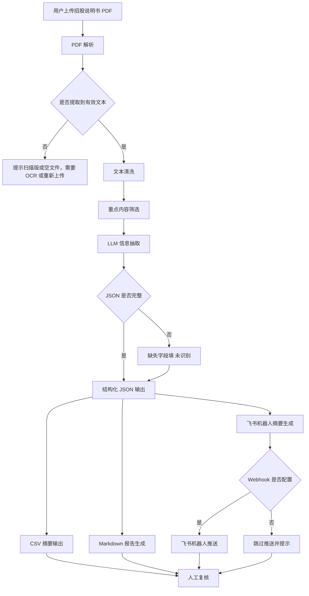

# 智能体工作流设计

## 工作流目标

ProspectusInsight Agent 聚焦招股说明书智能解读，将长 PDF 文档转换为结构化公司画像、报告和飞书摘要。

## Mermaid 流程图

## 关键设计原则

- 输入聚焦：当前版本只处理招股说明书 PDF。
- 证据追踪：解析文本保留页码标记。
- 容错优先：缺配置、缺字段、无文本都给出清晰提示。
- 协同输出：同时生成报告、表格、JSON 和飞书摘要。
- 人工复核：AI 输出不替代专业判断。

